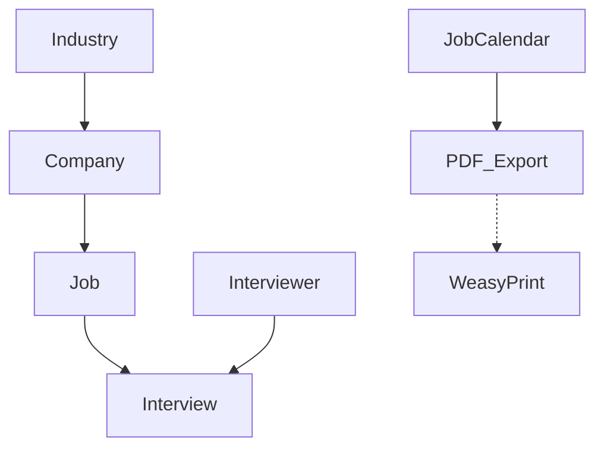

# JobSearch

A streamlined Django application to track the lifecycle of your job search, from initial application to final interview.

## 🚀 Getting Started

### Prerequisites (Fedora)
To support **PDF Exporting** via WeasyPrint, you must install the following system dependencies:

```bash
sudo dnf install pango-devel cairo-devel gdk-pixbuf2-devel libffi-devel
```
### Clone the repository
```bash
git clone git@github.com:vinnymurphy/jobsearch.git
```

### Setup the virtual environment
```bash
python3 -m venv venv
source venv/bin/activate
pip install -r requirements.txt
```
Verified Compatibility: Python 3.12 & 3.14-dev on Fedora 43 (x86_64).

## 🚀 Quick Start (Fedora)

To initialize the environment and database:
```bash
make setup
make migrate
make run

## 📊 Data Model

The application uses a relational structure to track the progression from lead to interview.

### Relational Overview
* **Industry** ↔ **Company**: One-to-Many (Companies are categorized by industry).
* **Company** ↔ **Job**: One-to-Many (A company can have multiple roles you are tracking).
* **Job** ↔ **Interview**: One-to-Many (A single job application can have multiple interview rounds).
* **Interviewer** ↔ **Interview**: Many-to-One (Tracking who you spoke with during each round).

### Schema Diagram
The relationship flow follows this logic:
`Industry` ➔ `Company` ➔ `Job` ➔ `Interview` ➔ `Interviewer`



## 🛠 Engineering Stack
- **OS:** Fedora 43 (Workstation Edition)
- **Language:** Python 3.12 / 3.14 (Tested for future-compatibility)
- **Framework:** Django 5.x / 6.x
- **Database:** SQLite (Local-first for privacy/speed)
- **Tooling:** `django-extensions`, `weasyprint` (for PDF generation), `Select2`

## 🏗 Design Philosophy
- **Local-First / Privacy-Centric:** Designed to run on a local Fedora workstation to keep proprietary job search data and interview notes out of the public cloud.
- **Observability:** Integrated with `django-debug-toolbar` for SQL query optimization and performance monitoring.
- **RelOps Automation:** Uses a Sunday-to-Saturday logical windowing system to automate government-mandated unemployment reporting, reducing administrative overhead from hours to seconds.